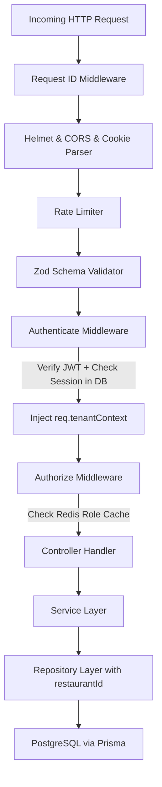

# Backend Architecture & Developer Guide (AI-Ready Documentation)

> **Repository:** `restaurant-management-backend`  
> **Runtime:** Node.js (ES Modules)  
> **Framework:** Express.js  
> **Database:** PostgreSQL via Prisma ORM  
> **In-Memory Cache & Lock Store:** Redis  
> **Real-Time Engine:** Socket.io  
> **Security & Validation:** Helmet, CORS, Cookie-Parser, Zod, Bcrypt, JWT, Pino Logger.

---

## 1. Executive Summary & Architectural Pillars

The backend is built as a modular multi-tenant SaaS backend for modern restaurant chains and individual restaurants. It enforces:
1. **Strict Multi-Tenancy Isolation:** Every database entity belongs to a `restaurant_id`. Requests by staff must pass `authenticate` and `requireTenantContext` middleware, injecting `req.tenantContext` which scopes all repository queries.
2. **Role-Based Access Control (RBAC):** Fine-grained permission strings (e.g. `orders.create`, `whatsapp.manage`, `employees.view`). System role `owner` bypasses checks; custom roles are fully configurable by tenant admins and cached in Redis with automatic cache invalidation on role update.
3. **Event-Driven Architecture (Domain Events):** An internal Event Bus publishes lifecycle events (`ORDER_CREATED`, `ORDER_STATUS_CHANGED`, `TABLE_SESSION_UPDATED`, `NOTIFICATION_CREATED`). Subscriptions handle audit logging, push notifications, and broadcast over Socket.io.
4. **Table Self-Ordering Session Engine:** Dine-in QR ordering with cryptographically generated 4-digit PINs, multi-member cart collaboration, multi-round kitchen orders, waiter assistance requests (`HELP`), and bill requests (`BILL`).
5. **WhatsApp Bot & Multi-Agent Inbox:** Meta Cloud API webhooks with HMAC-SHA256 signature verification, automated ordering flow state machine (Category $\rightarrow$ Product $\rightarrow$ Modifiers $\rightarrow$ Cart $\rightarrow$ Delivery Address $\rightarrow$ Confirmation), and seamless agent handoff.

---

## 2. Directory Structure & File Map

```
backend/
├── prisma/
│   ├── schema.prisma           # Complete PostgreSQL schema (tables, enums, relations, indexes)
│   └── migrations/             # Timestamped SQL database migration history
├── src/
│   ├── server.js               # HTTP + WebSocket server bootstrap & graceful shutdown
│   ├── app/
│   │   └── app.js              # Express app setup, middleware pipeline, route mounting
│   ├── config/
│   │   ├── env.js              # Validated environment variables (Zod)
│   │   ├── logger.js           # Pino logger configuration
│   │   └── redis.js            # Redis client connection & helpers
│   ├── lib/
│   │   ├── prisma.js           # PrismaClient instance with query logging
│   │   ├── socket.js           # Socket.io server instance & room manager
│   │   └── uploads.js          # Multer storage configuration & asset helper
│   ├── middleware/
│   │   └── error.middleware.js # Central error handler (AppError, ZodError, Prisma P2002/P2003/P2025)
│   ├── routes/
│   │   ├── index.js            # Main /api/v1 router aggregation
│   │   └── health.routes.js    # Liveness & readiness probes (/health, /api/v1/health)
│   ├── shared/                 # Shared errors, events, middleware & response formatters
│   │   ├── errors/             # AppError hierarchy (ValidationError, ConflictError, etc.)
│   │   ├── events/             # DomainEvent definitions and EventBus emitter
│   │   ├── middleware/         # RequestId, TenantContext, Zod Validator
│   │   └── utils/              # Unified response senders (sendSuccess, sendPaginated)
│   └── modules/                # Feature-based domain modules
│       ├── audit-logs/         # Security event timeline, subscriptions, repository
│       ├── auth/               # Register, Login, Refresh, Logout, JWT, RBAC authorize middleware
│       ├── branches/           # Branch management, working hours, settings repository
│       ├── coupons/            # Discount codes validation & redemption service
│       ├── customers/          # CRM customer profiles, phones, addresses
│       ├── dashboard/          # Analytics queries (revenue, channel split, trends)
│       ├── employees/          # Staff CRUD & branch access assignment
│       ├── inbox/              # Real-time multi-agent live chat for customer support
│       ├── kds/                # Kitchen Display System order queue
│       ├── menu/               # Categories, Products, Modifiers repository & service
│       ├── multi-branch/       # Multi-branch user switcher & branch access
│       ├── notifications/      # Notification dispatch, unread queries, preferences
│       ├── orders/             # Order lifecycle, POS checkout, invoice calculation, receipt printing
│       ├── permissions/        # Global permission key catalog
│       ├── phone-order/        # Fast phone order creation flow
│       ├── restaurants/        # Restaurant tenant profile & branding settings
│       ├── roles/              # RBAC roles CRUD & Redis permission cache
│       ├── table-sessions/     # QR self-ordering, PIN verification, waiter calls, draft submission
│       ├── tables/             # Floor management, capacity, QR token generator
│       ├── uploads/            # Multipart image upload controller
│       ├── whatsapp/           # Meta Cloud API integration, webhook verification, message log
│       └── whatsapp-automation/# WhatsApp interactive bot flow engine (state machine)
```

---

## 3. Database Schema Overview (Prisma Models)

The database schema (`prisma/schema.prisma`) comprises:
- **Tenancy Core:** `Restaurant`, `Branch`, `BranchSettings`, `WorkingHours`
- **Identity & RBAC:** `Employee`, `Role`, `Permission`, `RolePermission`, `Session`, `EmployeeBranchAccess`
- **Menu & Catalog:** `Category`, `Product`, `ProductModifierGroup`, `ModifierOption`, `ProductModifierAssignment`
- **Orders & Kitchen:** `Order`, `OrderItem`, `OrderStatusHistory`, `IdempotencyKey`, `Coupon`
- **Tables & Dine-In:** `RestaurantTable`, `TableSession`, `TableSessionMember`, `TableSessionItem`, `TableSessionOrder`, `TableSessionWaiterCall`
- **CRM & Communication:** `Customer`, `CustomerPhone`, `CustomerAddress`, `WhatsAppConnection`, `WhatsAppMessage`, `WhatsAppConversation`, `InboxConversation`, `InboxMessage`, `WebhookEvent`
- **System & Observability:** `Notification`, `NotificationPreference`, `AuditLog`

---

## 4. Multi-Tenant Context & Security Pipeline

Every authenticated API request passes through the following pipeline:



### Table Self-Ordering Security
Public QR routes use a distinct JWT model:
1. Customer enters table PIN $\rightarrow$ Backend hashes and compares with bcrypt.
2. If verified, backend issues a dedicated `table-member` JWT token containing `{ type: 'table-member', restaurantId, sessionId, memberId }`.
3. `requireMember` middleware guards all customer session actions (`addItem`, `submitDraft`, `callWaiter`).

---

## 5. Domain Events & Real-Time Sync Pipeline

```
Service Action (e.g. createOrder)
       │
       ▼
emitEvent(DomainEvent.ORDER_CREATED, payload)
       ├──► AuditLog Subscription ──► Insert into audit_logs
       ├──► Notification Subscription ──► Insert into notifications
       └──► Socket.io Broadcast ──► Send to branch room (branch:branchId)
```

---

## 6. Centralized Error Handling

All unhandled rejections and domain errors pass to `error.middleware.js`:
- **`AppError` subclasses:** Formatted into unified `{ success: false, error: { code, message, requestId, details } }`.
- **`ZodError`:** Formatted as `400 VALIDATION_ERROR` with path-level issues array.
- **`Prisma P2002` (Unique):** Formatted as `409 CONFLICT_ERROR` with the duplicated field name.
- **`Prisma P2025` (Not Found):** Formatted as `404 NOT_FOUND`.
- **`Prisma P2003` (Foreign Key):** Formatted as `409 CONFLICT_ERROR`.
- **`Prisma P2024` (Pool Timeout):** Formatted as `503 SERVICE_UNAVAILABLE`.
- **500 Server Error:** Sanitized in production to hide internal database schema strings while logging the full error stack with `requestId` to Pino logs.

---

## 7. How AI Models Should Work With This Backend

When developing or modifying backend endpoints:
1. **Find Domain Module:** Add logic inside `src/modules/<domain>/`.
2. **Follow Layered Architecture:**
   - Define validation schemas in `<domain>.validation.js`.
   - Register routes in `<domain>.routes.js` with `validate(schema)` and `authorize('perm.key')`.
   - Write controllers in `<domain>.controller.js` (extract params and call service).
   - Write business rules & transactions in `<domain>.service.js`.
   - Write Prisma queries in `<domain>.repository.js` (always passing `tenantContext.restaurantId`).
3. **Always Run Tests:** Execute `node --test tests/<domain>.test.js` to verify integrity.
